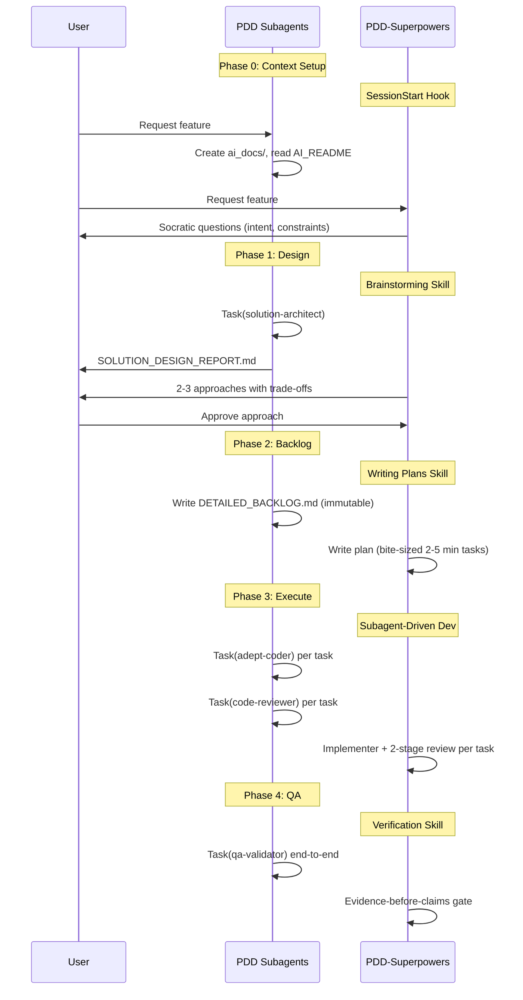

# PDD-Superpowers

PDD-Superpowers is a complete software development workflow for AI coding agents, built on composable "skills" — the standard used by major tools in the space (Claude Code, Codex, OpenCode). Skills are modular, discoverable workflow units that agents invoke automatically based on context.

This is the evolution of the **PDD subagents-based workflow** (the role-based agent orchestration system in the parent repo). If you're coming from that system, see [Migration from PDD Subagents-Based Workflow](#migration-from-pdd-subagents-based-workflow) below.

## How it works

It starts from the moment you fire up your coding agent. As soon as it sees that you're building something, it *doesn't* just jump into trying to write code. Instead, it steps back and asks you what you're really trying to do.

Once it's teased a spec out of the conversation, it shows it to you in chunks short enough to actually read and digest.

After you've signed off on the design, your agent puts together an implementation plan that's clear enough for an enthusiastic junior engineer with poor taste, no judgement, no project context, and an aversion to testing to follow. It emphasizes true red/green TDD, YAGNI (You Aren't Gonna Need It), and DRY.

Next up, once you say "go", it launches a *subagent-driven-development* process, having agents work through each engineering task, inspecting and reviewing their work, and continuing forward. It's not uncommon for Claude to be able to work autonomously for a couple hours at a time without deviating from the plan you put together.

There's a bunch more to it, but that's the core of the system. And because the skills trigger automatically, you don't need to do anything special. Your coding agent just has Superpowers.


## Sponsorship

If Superpowers has helped you do stuff that makes money and you are so inclined, I'd greatly appreciate it if you'd consider [sponsoring my opensource work](https://github.com/sponsors/obra).

Thanks!

- Jesse


## Installation

**Note:** Installation differs by platform. All platforms use a manual git clone workflow.

### Claude Code

1. **Clone the repository** (anywhere you like):
   ```bash
   git clone https://github.com/Loulen/PDD-superpowers.git ~/superpowers
   ```

2. **Register it as a local marketplace:**
   ```bash
   claude plugin marketplace add ~/superpowers
   ```

3. **Install the plugin:**
   ```bash
   claude plugin install "pdd-superpowers@superpowers-dev"
   ```

4. **Restart Claude Code** to load the plugin.

> **Note:** Claude Code caches plugins at install time. After pulling updates into your clone, run `claude plugin update "pdd-superpowers@superpowers-dev"` to refresh the cache. The `scripts/sync-clones.sh` script handles this automatically.

### Codex

Tell Codex:

```
Fetch and follow instructions from https://raw.githubusercontent.com/Loulen/PDD-superpowers/refs/heads/main/.codex/INSTALL.md
```

**Detailed docs:** [docs/README.codex.md](docs/README.codex.md)

### OpenCode

Tell OpenCode:

```
Fetch and follow instructions from https://raw.githubusercontent.com/Loulen/PDD-superpowers/refs/heads/main/.opencode/INSTALL.md
```

**Detailed docs:** [docs/README.opencode.md](docs/README.opencode.md)

### Verify Installation

Start a new session in your chosen platform and ask for something that should trigger a skill (for example, "help me plan this feature" or "let's debug this issue"). The agent should automatically invoke the relevant superpowers skill.

## The Basic Workflow

1. **brainstorming** - Activates before writing code. Refines rough ideas through questions, explores alternatives, presents design in sections for validation. Saves design document.

2. **using-git-worktrees** - Activates after design approval. Creates isolated workspace on new branch, runs project setup, verifies clean test baseline.

3. **writing-plans** - Activates with approved design. Breaks work into bite-sized tasks (2-5 minutes each). Every task has exact file paths, complete code, verification steps.

4. **subagent-driven-development** or **executing-plans** - Activates with plan. Dispatches fresh subagent per task with two-stage review (spec compliance, then code quality), or executes in batches with human checkpoints.

5. **test-driven-development** - Activates during implementation. Enforces RED-GREEN-REFACTOR: write failing test, watch it fail, write minimal code, watch it pass, commit. Deletes code written before tests.

6. **requesting-code-review** - Activates between tasks. Reviews against plan, reports issues by severity. Critical issues block progress.

7. **finishing-a-development-branch** - Activates when tasks complete. Verifies tests, presents options (merge/PR/keep/discard), cleans up worktree.

**The agent checks for relevant skills before any task.** Mandatory workflows, not suggestions.

## What's Inside

### Skills Library

**Testing**
- **test-driven-development** - RED-GREEN-REFACTOR cycle (includes testing anti-patterns reference)

**Debugging**
- **systematic-debugging** - 4-phase root cause process (includes root-cause-tracing, defense-in-depth, condition-based-waiting techniques)
- **verification-before-completion** - Ensure it's actually fixed

**Collaboration** 
- **brainstorming** - Socratic design refinement
- **writing-plans** - Detailed implementation plans
- **executing-plans** - Batch execution with checkpoints
- **dispatching-parallel-agents** - Concurrent subagent workflows
- **requesting-code-review** - Pre-review checklist
- **receiving-code-review** - Responding to feedback
- **using-git-worktrees** - Parallel development branches
- **finishing-a-development-branch** - Merge/PR decision workflow
- **subagent-driven-development** - Fast iteration with two-stage review (spec compliance, then code quality)

**Verification**
- **actionable-acceptance-criteria** - Concrete verification steps for acceptance criteria

**Visual**
- **mermaid-diagrams** - Minimal sequence/flowchart diagrams at key workflow points

**Meta**
- **writing-skills** - Create new skills following best practices (includes testing methodology)
- **using-superpowers** - Introduction to the skills system

## Philosophy

- **Test-Driven Development** - Write tests first, always
- **Systematic over ad-hoc** - Process over guessing
- **Complexity reduction** - Simplicity as primary goal
- **Evidence over claims** - Verify before declaring success

Read more: [Superpowers for Claude Code](https://blog.fsck.com/2025/10/09/superpowers/)

---

## Migration from PDD Subagents-Based Workflow

This section is for users coming from the PDD subagents-based workflow — the role-based agent orchestration system with named agents (TPM, Solution Architect, Adept Coder, Code Reviewer, QA Validator, Senior Coder) and a 5-phase waterfall pipeline managed through a monolithic CLAUDE.md.

### Why the shift

The PDD subagents-based workflow was effective but tightly coupled to one platform (Claude Code) and one architecture (a single CLAUDE.md orchestrator + agent prompt files). The AI coding ecosystem has since converged on **skills** as the standard unit of workflow — discoverable SKILL.md files with YAML frontmatter that any compliant tool can load. PDD-Superpowers adopts this standard to achieve cross-platform compatibility and better composability.

### Development Lifecycle Comparison



### Architecture Comparison

| Aspect | PDD Subagents-Based | PDD-Superpowers |
|--------|---------------------|-----------------|
| **Unit of workflow** | Named agent prompts (`.md` files in `agents/`) | Skills (SKILL.md with YAML frontmatter) |
| **Orchestration** | Monolithic CLAUDE.md (533 lines) acts as TPM | SessionStart hook + skill auto-discovery |
| **Platform support** | Claude Code only | Claude Code, Codex, OpenCode |
| **Design phase** | Solution Architect agent writes formal report | Brainstorming skill uses Socratic dialog |
| **Planning** | TPM writes DETAILED_BACKLOG.md | Writing Plans skill creates bite-sized tasks |
| **Implementation** | Adept Coder agent (single persona) | Templated subagents with embedded TDD |
| **Code review** | Code Reviewer agent (single pass, binary verdict) | Two-stage: spec compliance, then code quality |
| **QA** | Dedicated QA Validator agent | Verification-Before-Completion gate (embedded) |
| **Escalation** | Senior Coder after 2 review failures | No escalation ladder; two-stage review catches issues earlier |
| **Testing** | Advisory (best-practices files) | Mandatory TDD (iron law: no code without failing test) |
| **Debugging** | Claudeception skill (learn from issues) | Systematic Debugging skill (4-phase root cause) |
| **Git workflow** | Manual branching | Git Worktrees skill (automatic isolation) |
| **Branch completion** | Manual commit + cleanup | Finishing-a-Branch skill (4-option structured menu) |
| **Artifacts** | ai_docs/ folder (AI_README, CHANGELOG, design reports) | No persistent artifact folder; plans live in worktree |
| **Learning** | Claudeception hook extracts reusable knowledge | Writing-skills skill for creating new skills via TDD |
| **Parallel work** | Not supported | Dispatching Parallel Agents skill |

### What was kept

These concepts survived the migration because they work:

- **Actionable acceptance criteria** — verification requires execution, not inspection
- **Subagent delegation** — fresh agents per task for focused execution
- **User approval gates** — design and plan require sign-off before work begins
- **Code review before merge** — no code lands without review
- **Immutable plans** — once approved, plans don't change mid-execution

### What was dropped

- **Named agent personas** (TPM, Solution Architect, Adept Coder, etc.) — replaced by composable skills that any agent can adopt
- **The `ai_docs/` folder convention** (AI_README.md, AI_CHANGELOG.md, SOLUTION_DESIGN_REPORT.md) — replaced by in-context workflow without persistent artifact folders
- **The monolithic CLAUDE.md orchestrator** (533-line TPM prompt) — replaced by a lightweight SessionStart hook that bootstraps skill discovery
- **The QA Validator as a dedicated role** — verification is now an embedded gate in every workflow step, not a final phase
- **The Senior Coder escalation ladder** — two-stage review catches quality issues earlier, removing the need for escalation
- **Platform lock-in** — the old system only worked with Claude Code's Task tool

### What was added

- **TDD as a non-negotiable discipline** — not advisory best-practices files but an iron law enforced at every implementation step
- **Git worktree isolation** — automatic workspace isolation instead of manual branching
- **Systematic debugging** — a 4-phase root-cause process replacing ad-hoc investigation
- **Multi-platform support** — skills work across Claude Code, Codex, and OpenCode with documented compatibility matrix and fallbacks
- **Anti-rationalization enforcement** — skills include tables of common excuses and red flags to prevent agents from skipping discipline
- **Mermaid diagrams at checkpoints** — visual progress summaries wired into 4 different skills
- **Parallel agent dispatch** — concurrent execution of independent tasks
- **Two-stage code review** — spec compliance first, then code quality (not a single binary pass/fail)

### The fundamental shift

The PDD subagents-based workflow asked **"who does the work?"** — each role had strict boundaries (the TPM never codes, the Code Reviewer gives binary verdicts, the QA Validator must actually run the app). Quality was entrusted to specific personas.

PDD-Superpowers asks **"how is the work done?"** — skills are composable behaviors that embed discipline directly into every workflow step. Quality isn't a phase or a role; it's a property of the process itself.

---

## Contributing

Skills live directly in this repository. To contribute:

1. Fork the repository
2. Create a branch for your skill
3. Follow the `writing-skills` skill for creating and testing new skills
4. Submit a PR

See `skills/writing-skills/SKILL.md` for the complete guide.

## Updating

Run the sync script to pull changes and refresh all deployed copies:

```bash
bash scripts/sync-clones.sh
```

See [UPDATE.md](UPDATE.md) for details on what the script does for each platform.

## License

MIT License - see LICENSE file for details

## Support

- **Issues**: https://github.com/Loulen/PDD-superpowers/issues
- **Upstream**: https://github.com/obra/superpowers
