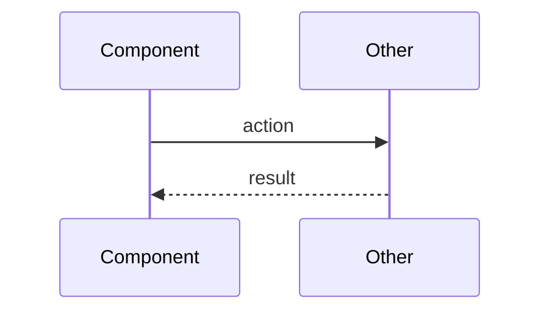

# Skills & Primitives Update — Implementation Plan

> **For Claude:** REQUIRED SUB-SKILL: Use superpowers:executing-plans to implement this plan task-by-task.

**Goal:** Update 6 existing skills and add 2 new skills to improve the development workflow (conditional commits, vibe-kanban tracking, mermaid diagrams, default subagent-driven, actionable acceptance criteria).

**Architecture:** Markdown-only changes to skill files in `pdd-superpowers/skills/`. Two new skill directories added. Wiring added as directive references in existing skills.

**Tech Stack:** Markdown skill files only. No code changes.

---

### Task 1: Add conditional commit rule to verification-before-completion

**Files:**
- Modify: `skills/verification-before-completion/SKILL.md`

**Step 1: Add commit gate section after "The Gate Function" (after line 38)**

Add this new section between "The Gate Function" and "Common Failures":

```markdown
## Commit Gate

```
BEFORE committing changes:

1. Am I in autonomous mode? (subagent-driven-development with spec+code review)
   - YES → Commit is allowed (reviews serve as validation)
   - NO → Continue to step 2
2. Has the user explicitly validated this behavior?
   - YES → Commit
   - NO → Stage changes only. Do NOT commit.

Interactive human-in-the-loop work = stage, don't commit.
Autonomous subagent-driven work with reviews = commit is fine.
```

**Why:** During interactive iterations, auto-committing creates dozens of tiny commits. During autonomous execution, committing after reviews pass is appropriate since the review cycle serves as validation.
```

**Step 2: Verify the change reads correctly**

Read `skills/verification-before-completion/SKILL.md` and confirm the new section sits between "The Gate Function" and "Common Failures" and doesn't break the flow.

**Step 3: Commit**

```bash
git add skills/verification-before-completion/SKILL.md
git commit -m "Add conditional commit gate to verification-before-completion

During interactive work, stage only — don't auto-commit until user validates.
During autonomous subagent-driven work, committing after reviews is fine."
```

---

### Task 2: Add vibe-kanban task tracking to finishing-a-development-branch

**Files:**
- Modify: `skills/finishing-a-development-branch/SKILL.md`

**Step 1: Add Step 6 after Step 5 (Cleanup Worktree), before Quick Reference**

Insert after line 150 (`**For Option 3:** Keep worktree.`) and before `## Quick Reference`:

```markdown
### Step 6: Update Task Tracker

**After executing the chosen option (Steps 4-5):**

If vibe-kanban MCP tools are available (test by calling `get_context`):

1. Ask the user: "Is this task done?"
2. If **yes**: Update the linked issue status to "Done" via `update_issue`
3. If **not done**: Ask if the status should be updated to something else (e.g., "In Review" for PRs)
4. If **no vibe-kanban**: Skip this step silently

**This step runs for ALL options** (merge, PR, keep, discard) — the task status is independent of the git integration choice.
```

**Step 2: Update the "Core principle" line at the top**

Change line 12 from:
```
**Core principle:** Verify tests → Present options → Execute choice → Clean up.
```
to:
```
**Core principle:** Verify tests → Present options → Execute choice → Clean up → Update tracker.
```

**Step 3: Update the Integration section to mention vibe-kanban**

Add to the "Pairs with" section at the end:

```markdown
- **vibe-kanban MCP** - Updates task status after branch integration (if available)
```

**Step 4: Verify the change reads correctly**

Read the full file and confirm Step 6 appears after Step 5, before Quick Reference, and the flow is coherent.

**Step 5: Commit**

```bash
git add skills/finishing-a-development-branch/SKILL.md
git commit -m "Add vibe-kanban task tracking to finishing-a-development-branch

After executing the chosen option, ask user if task is done and
update the linked vibe-kanban issue status accordingly."
```

---

### Task 3: Create mermaid-diagrams skill

**Files:**
- Create: `skills/mermaid-diagrams/SKILL.md`

**Step 1: Create the skill file**

Create `skills/mermaid-diagrams/SKILL.md` with this exact content:

```markdown
---
name: mermaid-diagrams
description: Use when a workflow step requires rendering a diagram to the user — produces minimal mermaid sequence or flowchart diagrams that give a bird's-eye view of technical work
---

# Mermaid Diagrams

## Overview

Render minimal mermaid diagrams to give the user a high-level view of technical work. Diagrams are communication tools, not documentation — they should be fast to read and immediately useful.

**Core principle:** Minimal but sufficient. If the user needs to squint, the diagram is too complex.

## Diagram Type Selection

1. **Sequence diagrams** (preferred) — use when showing interactions between components, systems, or actors over time. Best for: API flows, subagent workflows, request/response patterns, debugging expected-vs-actual.

2. **Flowcharts** (fallback) — use when showing decision logic or process steps where sequence doesn't fit. Best for: plan overviews, decision trees, state transitions.

**Never use:** class diagrams, ER diagrams, Gantt charts, or other complex diagram types. If the concept can't be expressed as a sequence or flowchart, describe it in text instead.

## Constraints

- **Maximum ~10 nodes.** If you need more, you're showing too much detail. Zoom out.
- **No implementation details.** Show components and their interactions, not code or internal logic.
- **Label edges meaningfully.** An arrow without a label is wasted information.
- **Use short names.** "Auth" not "AuthenticationService", "DB" not "PostgreSQL Database Server".

## Rendering

Output diagrams as fenced mermaid code blocks in your message to the user:

~~~

~~~

## When Invoked By Other Skills

This skill is invoked at specific workflow points. At each point, the diagram serves a different purpose:

| Invoking skill | When | Purpose |
|---------------|------|---------|
| subagent-driven-development | After a subagent completes a task | Show what was built and how components interact |
| finishing-a-development-branch | Before presenting options | Summarize all work done on the branch |
| systematic-debugging | During investigation | Show expected behavior vs actual behavior |
| writing-plans | After plan is saved | Show overview of the plan's task dependencies |
```

**Step 2: Verify the skill file**

Read `skills/mermaid-diagrams/SKILL.md` and confirm frontmatter has only `name` and `description`, description starts with "Use when...", and content is under 500 words.

**Step 3: Commit**

```bash
git add skills/mermaid-diagrams/SKILL.md
git commit -m "Add mermaid-diagrams skill

Lightweight skill for rendering minimal sequence/flowchart diagrams at
key workflow points. Sequence preferred, ~10 nodes max."
```

---

### Task 4: Wire mermaid-diagrams into subagent-driven-development

**Files:**
- Modify: `skills/subagent-driven-development/SKILL.md`

**Step 1: Add diagram directive after "Mark task complete in TodoWrite"**

In the process section, after the `"Mark task complete in TodoWrite"` node and before `"More tasks remain?"`, add a directive. Insert after line 78 (`"Mark task complete in TodoWrite" -> "More tasks remain?";`), changing that line to route through a diagram step:

In the process graph, replace line 78:
```
    "Mark task complete in TodoWrite" -> "More tasks remain?";
```
with:
```
    "Render mermaid diagram of completed task (superpowers:mermaid-diagrams)" [shape=box];
    "Mark task complete in TodoWrite" -> "Render mermaid diagram of completed task (superpowers:mermaid-diagrams)";
    "Render mermaid diagram of completed task (superpowers:mermaid-diagrams)" -> "More tasks remain?";
```

**Step 2: Add mermaid-diagrams to the Integration section**

Add under "Subagents should use:" (after line 239):

```markdown
- **superpowers:mermaid-diagrams** - Render diagram after each task completes
```

**Step 3: Verify the graph still parses and the integration section is coherent**

Read the full file and check that the graph flows correctly with the new node.

**Step 4: Commit**

```bash
git add skills/subagent-driven-development/SKILL.md
git commit -m "Wire mermaid-diagrams into subagent-driven-development

Render a diagram after each task completes showing what was built."
```

---

### Task 5: Wire mermaid-diagrams into finishing-a-development-branch

**Files:**
- Modify: `skills/finishing-a-development-branch/SKILL.md`

**Step 1: Add diagram step before presenting options**

Insert a new step between Step 2 (Determine Base Branch) and Step 3 (Present Options). The current Step 3 becomes Step 4, etc. Add after line 47 (`Or ask: "This branch split from main - is that correct?"`):

```markdown
### Step 3: Summarize Work Done

**Before presenting options, render a mermaid diagram** (invoke `superpowers:mermaid-diagrams`) showing a high-level summary of all work done on the branch. Use `git log --oneline <base>..HEAD` to understand the scope.

Present the diagram to the user along with a brief text summary.
```

Then renumber: old Step 3 → Step 4, old Step 4 → Step 5, old Step 5 → Step 6, old Step 6 (vibe-kanban from Task 2) → Step 7.

**Step 2: Update the "Core principle" line**

Change to:
```
**Core principle:** Verify tests → Summarize work → Present options → Execute choice → Clean up → Update tracker.
```

**Step 3: Verify numbering is consistent**

Read the full file and verify step numbers are sequential and cross-references (like "Then: Cleanup worktree (Step 6)") are updated.

**Step 4: Commit**

```bash
git add skills/finishing-a-development-branch/SKILL.md
git commit -m "Wire mermaid-diagrams into finishing-a-development-branch

Render summary diagram of all branch work before presenting options."
```

---

### Task 6: Wire mermaid-diagrams into systematic-debugging

**Files:**
- Modify: `skills/systematic-debugging/SKILL.md`

**Step 1: Add diagram directive in Phase 1 (Root Cause Investigation)**

After line 64 (the "If not reproducible" bullet), add a new item 2.5 between "Reproduce Consistently" and "Check Recent Changes":

```markdown
   **After reproducing, render expected-vs-actual diagram:**

   Invoke `superpowers:mermaid-diagrams` to show:
   - A sequence diagram of **expected behavior** (what should happen)
   - vs **actual behavior** (what is happening)

   This helps visualize where the flow diverges.
```

**Step 2: Add to Related skills section**

After line 288 (`- **superpowers:verification-before-completion** - Verify fix worked before claiming success`), add:

```markdown
- **superpowers:mermaid-diagrams** - Visualize expected vs actual behavior during investigation
```

**Step 3: Verify the change reads naturally in the Phase 1 flow**

Read the full file around the insertion point and confirm it doesn't break the numbered list flow.

**Step 4: Commit**

```bash
git add skills/systematic-debugging/SKILL.md
git commit -m "Wire mermaid-diagrams into systematic-debugging

Render expected-vs-actual sequence diagram during root cause investigation."
```

---

### Task 7: Wire mermaid-diagrams into writing-plans and default to subagent-driven

**Files:**
- Modify: `skills/writing-plans/SKILL.md`

**Step 1: Add diagram directive after plan is saved**

Replace the entire "Execution Handoff" section (lines 98-117) with:

```markdown
## After Saving the Plan

**Render a mermaid diagram** (invoke `superpowers:mermaid-diagrams`) showing a high-level overview of the plan's task flow. Tell the user where the plan is saved.

## Execution Handoff

After saving the plan, proceed directly with subagent-driven development:

**"Plan complete and saved to `docs/plans/<filename>.md`. Proceeding with subagent-driven execution."**

- **REQUIRED SUB-SKILL:** Use superpowers:subagent-driven-development
- Stay in this session
- Fresh subagent per task + code review

**Platform fallback:** If the platform does not support subagents (e.g. Codex — no Task tool available), fall back to `superpowers:executing-plans` for sequential batch execution. Guide the user to open a new session in the worktree.

**User override:** If the user explicitly requests a parallel session or executing-plans, honor that request.
```

**Step 2: Verify the change reads correctly**

Read the full file and confirm the flow from "Remember" → "After Saving the Plan" → "Execution Handoff" is coherent.

**Step 3: Commit**

```bash
git add skills/writing-plans/SKILL.md
git commit -m "Default to subagent-driven-development in writing-plans

Remove choice prompt, default to subagent-driven. Fallback to
executing-plans for platforms without subagent support (Codex).
Add mermaid diagram rendering after plan is saved."
```

---

### Task 8: Import actionable-acceptance-criteria skill

**Files:**
- Create: `skills/actionable-acceptance-criteria/SKILL.md`

**Step 1: Create the skill file**

Create `skills/actionable-acceptance-criteria/SKILL.md` adapted from the original at `~/.claude_from_old/skills/actionable-acceptance-criteria/SKILL.md`. Adapt frontmatter to superpowers conventions (only `name` and `description`, description starts with "Use when..."):

```markdown
---
name: actionable-acceptance-criteria
description: Use when writing acceptance criteria for features, plan tasks, or issues — elevates each criterion with concrete verification steps that prove implementation works by interacting with the real system
---

# Actionable Acceptance Criteria

## Core Principle

**"Is my implementation working?"** can only be answered by **interacting with the real thing**.

Verification requires execution, not inspection. The goal is to prove the implementation works by observing its actual behavior, not by confirming code exists.

### The Fundamental Question

Ask yourself: **"What can I actually run, call, or query to prove this works?"**

---

## Driving Questions for Verification

When defining acceptance criteria or validating an implementation, ask:

1. **What command can I run** to see this in action?
2. **What endpoint can I call** to test the behavior?
3. **What query can I execute** to see the result?
4. **What observable effect** should this produce?
5. **What tool gives me direct access** to the running system?
6. **How would a human verify** this works?
7. **What evidence proves** the feature is functioning?

---

## Verification Hierarchy

Prioritize verification approaches in this order:

1. **Execute the thing** - Run the actual code, pipeline, or service
2. **Observe the output** - Check logs, responses, return values
3. **Query the state** - Examine database, filesystem, API state
4. **Test the interaction** - Use the feature as a user would (Playwright MCP, browser, UI)

---

## Available Tools to Consider

Think about what tools can interact with your implementation:

| Tool Category | Examples | Use For |
|---------------|----------|---------|
| Terminal (Bash) | CLI commands, scripts, curl | Running code, calling APIs, checking processes |
| Browser MCP | Playwright, Chrome DevTools | UI interactions, network inspection, visual verification |
| Database access | psql, mysql, mongo shell | Verifying data state, checking records |
| Cloud CLIs | aws, gcloud, az, kubectl | Checking deployed resources, container state |
| Container tools | docker exec, docker logs | Inspecting running services |
| Test runners | pytest, jest, gradle test | Executing test suites |
| HTTP tools | curl, httpie, wget | Direct API calls |
| One-off scripts | Python/bash scripts | Custom verification for complex scenarios |

---

## Anti-Patterns

What NOT to do when writing acceptance criteria:

| Anti-Pattern | Why It Fails | Better Approach |
|--------------|--------------|-----------------|
| "Code exists in file X" | Existence doesn't prove functionality | Run the code and observe behavior |
| "Tests pass" (without running them) | Assumption without verification | Execute `pytest` / `npm test` and check output |
| "Syntax is correct" | Compiling doesn't mean working | Execute and verify results |
| "Deployment succeeded" (based on script exit) | Script success doesn't prove functionality | Call the deployed service |
| "Configuration is set" | Config existence doesn't mean it's applied | Query the running system's actual state |
| "Logs show no errors" | Absence of errors doesn't prove correctness | Verify positive evidence of correct behavior |

---

## Applying the Principle

When you encounter a task requiring verification:

1. **Stop and think:** What is the actual behavior I need to verify?
2. **Identify the interaction point:** What tool or command gives me access?
3. **Define observable evidence:** What specific output/state proves success?
4. **Write the verification step:** Include the exact command/action and expected result
5. **Report concrete findings:** Share what you observed, not what you assumed

The goal is **proof through interaction**, not confidence through inspection.
```

**Step 2: Verify the skill file**

Read `skills/actionable-acceptance-criteria/SKILL.md` and confirm frontmatter is correct, description starts with "Use when...", and content follows superpowers conventions.

**Step 3: Commit**

```bash
git add skills/actionable-acceptance-criteria/SKILL.md
git commit -m "Import actionable-acceptance-criteria skill into superpowers

Copied from ~/.claude_from_old/skills/ and adapted to superpowers
conventions. Elevates acceptance criteria with concrete verification
steps using real tools (Playwright, CLI, database queries, etc.)."
```

---

### Task 9: Wire actionable-acceptance-criteria into writing-plans and spec reviewer

**Files:**
- Modify: `skills/writing-plans/SKILL.md`
- Modify: `skills/subagent-driven-development/spec-reviewer-prompt.md`

**Step 1: Add acceptance criteria directive to writing-plans**

In `skills/writing-plans/SKILL.md`, add after the "Remember" section (after line 95 `- DRY, YAGNI, TDD, frequent commits`):

```markdown
## Acceptance Criteria

**REQUIRED SUB-SKILL:** Use superpowers:actionable-acceptance-criteria when writing acceptance criteria for each task.

Every task's acceptance criteria MUST include concrete verification steps — commands to run, endpoints to call, queries to execute, or observable effects to check. Never write criteria that can only be verified by reading code.
```

**Step 2: Add acceptance criteria verification to spec-reviewer-prompt.md**

In `skills/subagent-driven-development/spec-reviewer-prompt.md`, add a new section inside the prompt template, after the "Misunderstandings" section (after line 53) and before "Verify by reading code":

```markdown
    **Acceptance criteria verification:**
    - Does each acceptance criterion have a concrete verification step?
    - Were the verification steps actually executed (not just inspected)?
    - Is there evidence of real interaction (command output, API response, query result)?
    - Flag any criterion that was "verified" only by reading code — that's not verification
```

**Step 3: Verify both files read correctly**

Read both files and confirm the additions integrate naturally.

**Step 4: Commit**

```bash
git add skills/writing-plans/SKILL.md skills/subagent-driven-development/spec-reviewer-prompt.md
git commit -m "Wire actionable-acceptance-criteria into plans and spec reviewer

Plans must include concrete verification steps for acceptance criteria.
Spec reviewer checks that criteria were actually verified by execution."
```
