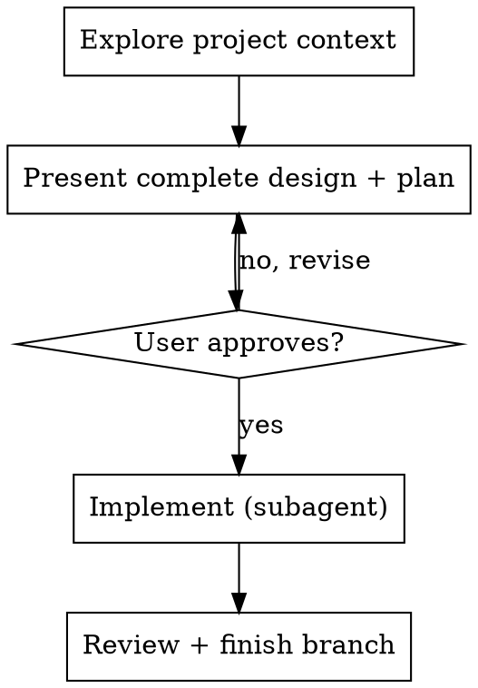

# Fast Mode

## Overview

Compressed workflow for small, well-defined tasks. Replaces the full brainstorming → writing-plans → subagent pipeline with a single design-and-plan presented for one approval before implementation.

**This skill is never auto-selected.** The user must explicitly invoke it. If you think a task is "simple enough" for fast mode, use the full brainstorming skill anyway — the user decides when to skip the full process, not you.

## When This Fits

- Task touches 1-3 files
- Single concern (one feature, one fix, one refactor)
- User's request already contains enough detail — no ambiguity to resolve
- No architectural decisions or trade-offs worth debating

If any of these don't hold, tell the user and fall back to the full brainstorming skill.

## The Process

### Step 1: Explore context

Read the relevant files. Understand the current state. This step is not optional — skipping it is how "simple" tasks go wrong.

### Step 2: Present design + plan in one message

Combine what brainstorming and writing-plans would produce separately into a single message:

**Design:**
- What changes and why (2-3 sentences)
- Which files are affected
- Data flow if relevant — render a mermaid sequence diagram (invoke `superpowers:mermaid-diagrams`)

**Plan:**
- Concrete steps with file paths and code sketches
- Test strategy (what to test, how to verify)
- Single commit message

Ask the user: "Does this look right? I'll implement on approval."

### Step 3: Implement

On approval:
- Dispatch a subagent (invoke `superpowers:subagent-driven-development` with the plan as a single task)
- The subagent implements, tests, and commits
- Spec review + code quality review still happen (same two-stage review as full workflow)

**Platform fallback:** If subagents are unavailable, implement directly following TDD (invoke `superpowers:test-driven-development`).

### Step 4: Finish

Invoke `superpowers:finishing-a-development-branch` to present completion options.

## Guard Rails

- **Still requires user approval.** Fast mode compresses the process, it doesn't skip consent.
- **Fall back if scope creeps.** If during context exploration you discover the task is bigger than it looked, say so and switch to the full brainstorming skill.
- **No design doc.** Fast mode skips writing `docs/plans/` files — the plan lives in the conversation. This is the trade-off for speed.
- **One task only.** If the plan would have multiple independent tasks, use the full workflow instead.
