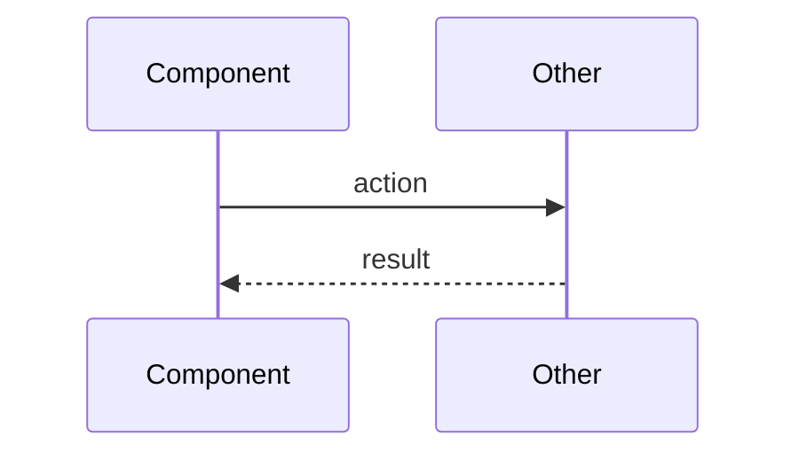

# Mermaid Diagrams

## Overview

Render minimal mermaid diagrams to give the user a high-level view of technical work. Diagrams are communication tools, not documentation — they should be fast to read and immediately useful.

**Core principle:** Minimal but sufficient. If the user needs to squint, the diagram is too complex.

## Diagram Type Selection

1. **Sequence diagrams** (preferred) — use when showing interactions between components, systems, or actors over time. Best for: API flows, subagent workflows, request/response patterns, debugging expected-vs-actual.

2. **Flowcharts** (fallback) — use when showing decision logic or process steps where sequence doesn't fit. Best for: plan overviews, decision trees, state transitions.

**Never use:** class diagrams, ER diagrams, Gantt charts, or other complex diagram types. If the concept can't be expressed as a sequence or flowchart, describe it in text instead.

## Constraints

- **Maximum ~10 nodes.** If you need more, you're showing too much detail. Zoom out.
- **No implementation details.** Show components and their interactions, not code or internal logic.
- **Label edges meaningfully.** An arrow without a label is wasted information.
- **Use short names.** "Auth" not "AuthenticationService", "DB" not "PostgreSQL Database Server".

## Rendering

Output diagrams as fenced mermaid code blocks in your message to the user:

~~~

~~~

## When Invoked By Other Skills

This skill is invoked at specific workflow points. At each point, the diagram serves a different purpose:

| Invoking skill | When | Purpose |
|---------------|------|---------|
| subagent-driven-development | After a subagent completes a task | Show what was built and how components interact |
| finishing-a-development-branch | Before presenting options | Summarize all work done on the branch |
| systematic-debugging | During investigation | Show expected behavior vs actual behavior |
| writing-plans | After plan is saved | Show overview of the plan's task dependencies |
